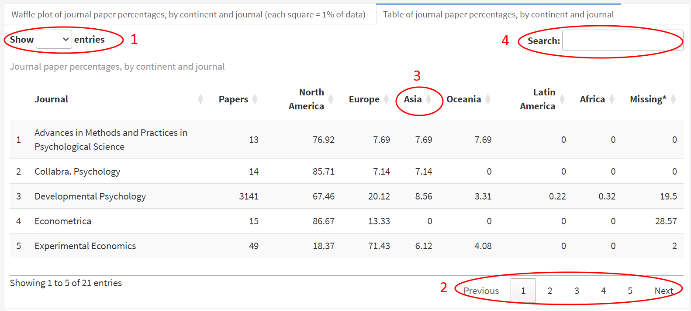

<script>
   document.querySelector(".navbar-header").innerHTML =
            "<a href=\"#home\" class=\"navbar-brand navbar-inverse\">The Missing Majority Dashboard</a>";
</script> 

# Home {.hidden}

```{r setup, include=FALSE}
query_pubmed <- FALSE
options(scipen = 999)
```

```{r packages}
# Load packages
library(pubmedDashboard)
library(dplyr)
library(ggflags)

```

```{r API_TOKEN_PUBMED, eval=query_pubmed, include=FALSE}
if(Sys.info()["sysname"] == "Windows") {
  API_TOKEN_PUBMED <- keyring::key_get("pubmed", "rempsyc")  
}

check_pubmed_api_token(API_TOKEN_PUBMED)

```

```{r save_process_pubmed_batch_psychology, results='hide', eval=query_pubmed}
# We got a little problem with PLOS One, Science, Nature, and PNAS
# So we proceed separately for each...
save_process_pubmed_batch(
  journal = journal_field %>%
  filter(field == "psychology") %>% 
    pull(journal),
  year_low = 2024,
  year_high = 2030,
  suffix = "psychology",
  api_key = API_TOKEN_PUBMED)
```

```{r save_process_pubmed_batch_economics, results='hide', eval=query_pubmed}
save_process_pubmed_batch(
  journal = journal_field %>%
    filter(field == "economics") %>% 
    pull(journal),
  year_low = 2024,
  year_high = 2030,
  suffix = "economics",
  api_key = API_TOKEN_PUBMED)
```

```{r save_process_pubmed_batch_pnas, results='hide', eval=query_pubmed}
save_process_pubmed_batch(
  journal = "Proceedings of the National Academy of Sciences of the United States of America",
  year_low = 2024,
  year_high = 2030,
  suffix = "pnas",
  api_key = API_TOKEN_PUBMED)
```

```{r save_process_pubmed_batch_science, results='hide', eval=query_pubmed}
save_process_pubmed_batch(
  journal = "Science (New York, N.Y.)",
  year_low = 2024,
  year_high = 2030,
  suffix = "science",
  api_key = API_TOKEN_PUBMED)
```

```{r save_process_pubmed_batch_nature, results='hide', eval=query_pubmed}
save_process_pubmed_batch(
  journal = "Nature",
  year_low = 2024,
  year_high = 2030,
  suffix = "nature",
  api_key = API_TOKEN_PUBMED)
```

```{r save_process_pubmed_batch_plos, results='hide', eval=query_pubmed}
# save_process_pubmed_batch(
#   journal = "PloS one",
#   year_low = 2024,
#   year_high = 2030,
#   suffix = "plos",
#   api_key = API_TOKEN_PUBMED)

```

```{r get_historic_data}
articles.df4 <- read_bind_all_data()

# We filter for year 1987 because there are almost no publications before that
articles.df4 <- articles.df4 %>%
  filter(year >= 1987)
```

```{r clean_journals_continents}
articles.df4 <- clean_journals_continents(articles.df4)

```

```{r exclude_other_journals}

# And only include journals from the official list because it seems we
# are getting a lot of other journals
exclude <- unique(articles.df4$journal)[!unique(
  toupper(articles.df4$journal)) %in% toupper(
    c(journal_field$journal, journal_field$journal_short))]

articles.df4 <- articles.df4 %>%
  filter(!journal %in% exclude)

stats_continent <- table_continent(articles.df4, datatable = FALSE)
stats_country <- table_country(articles.df4, datatable = FALSE)

saveRDS(articles.df4, "data/fulldata.rds")
```

## Row 1 {data-height=500}

### {data-width=1160}

[The Global South continues to be underrepresented in psychological research]{.big_center}

### **First authors in psychology and behavioural science from...**

<!-- #### First authors in psychology and behavioural science from... -->

```{r}
rate <- round(stats_continent$`Latin America` + stats_continent$Africa)
flexdashboard::gauge(
  rate, 
  min = 0, 
  max = 100, 
  symbol = '%', 
  flexdashboard::gaugeSectors(
    danger = c(0, 40), 
    warning = c(40, 79), 
    success = c(80, 100)),
  abbreviateDecimals = 1, 
  href = "#continent",
  label = "Latin America & Africa"
)
```

<!-- #### From Latin America and Africa -->

```{r, eval=T}
rate <- stats_country %>% 
  filter(Country == "United States") %>% 
  pull(Percentage) %>% 
  round()
flexdashboard::gauge(
  rate, 
  min = 0, 
  max = 100, 
  symbol = '%', 
  flexdashboard::gaugeSectors(
    success = c(0, 40), 
    warning = c(40, 79), 
    danger = c(80, 100)),
  abbreviateDecimals = 1, 
  href = "#country",
  label = "USA"
)
```

<!-- #### From the US -->

```{r, eval=T}
rate <- round(stats_continent$`North America` + stats_continent$Europe)
flexdashboard::gauge(
  rate, 
  min = 0, 
  max = 100, 
  symbol = '%', 
  flexdashboard::gaugeSectors(
    danger = c(0, 40), 
    warning = c(40, 79), 
    success = c(80, 100)),
  abbreviateDecimals = 1, 
  href = "#continent",
  label = "North America & Europe"
)
```

<!-- #### From North America and Europe -->

## Row 2

### **Representativity of First Authors in Psychology**

A large proportion of first authors in psychology and behavioural science are located in North America or Europe, mostly in the US ([Thalmayer et al., 2021](https://psycnet.apa.org/doi/10.1037/amp0000622), [Arnett, 2008](https://doi.org/10.1037/0003-066x.63.7.602)). Thus, most of the world, and especially Africa and Latin America, are underrepresented, which could affect the validity and generalizability of psychological research. This dashboard presents some aggregated data by continent, country, year, and journal (for first authors only), to better document this trend over time and, possibly, inform future public policy on the matter.

If this matters to you, please [reach out](https://www.busara.global/partner-with-us/).

---

**How to cite this dashboard?**

Thériault, R., & Forscher, P. (2024). *The Missing Majority Dashboard*. https://remi-theriault.com/dashboards/missing_majority

### **Choice of Journals**

The data from this report originally included information about publications from six psychology journals (*Developmental Psychology*, *Journal of Personality and Social Psychology*, *Journal of Abnormal Psychology*, *Journal of Family Psychology*, *Health Psychology*, and *Journal of Educational Psychology*), for years 1987 to 2023.

These journals were initially selected based on Arnett and colleagues' papers. The dashboard now includes many more psychology and behavioural science journals, which were selected through brainstorming from a group of experts. You can see the full list of journals on the [Methods] tab. If you think a journal should be there and it's not, please open a [Github issue](https://github.com/rempsyc/busara_dashboard/issues/) and we'll add it.

---

*This dashboard was created with the `pubmedDashboard` package in R: https://rempsyc.github.io/pubmedDashboard/.*

### **About the Authors**

**[Rémi Thériault](https://remi-theriault.com/)** is currently a PhD candidate in Psychology at the Université du Québec à Montréal, Canada. Overall, Rémi is passionate about putting social-psychological research to use to increase people’s well-being and intrinsic motivation to help one another. He also has a (tiny bit obsessive) passion for programming with R.

**[Patrick Forscher](https://busaracenter.org/patrick-s-forscher/)** is the primary collaborator on this project. He is currently the Research Lead at the Busara Center for Behavioral Economics, in Kenya, where he also leads the Culture, Research Ethics, and MEthods (CREME) project as director of the Meta-Research Team. The dashboard was Patrick's original vision, and frequently benefits from his creative input.

**[Busara](https://www.busara.global/)** is the dashboard's sponsor. Busara works with researchers and organizations to advance and apply behavioral science in pursuit of poverty alleviation. They use behavioral science to design solutions for partner organisations that are working to make lives better in the Global South.

# Methods

### **METHOD & DATA**

The dashboard includes information about the articles (e.g., title, abstract) as well as on the authors, such as university of affiliation. I have obtained these data from PubMed using the PubMed API through the `easyPubMed` package. I have determined the country of the first author of each paper based on the affiliation address by matching the university name with a world university names database obtained from GitHub.

The full current list of journals queried can be obtained through the following R code `pubmedDashboard::journal_field$journal_short` (note that PLOS One was only included until 2011 because its number of papers then becomes too large to handle for this dashboard):

On the right, we can see the list of journals included in this dashboard following the above query. The table also includes the number of publication for each journal; this is our sample size of sort. These data helps us understand in part the quality of the PubMed data, to the extent that some journals have poor PubMed indexation or no indexation at all. For example, the journals below had no PubMed matches at all:

```{r, journal_match, eval=T}

missing_journals <- detect_missing_journals(articles.df4)
missing_journals %>% 
  filter(found == FALSE)

# cat("The following non-requested journals were also excluded from the results:\n")
# exclude
```

### **JOURNAL COUNT**

```{r, journal_count}

table_journal_count(data = articles.df4)

```

# Instructions

### **USING FIGURES**

Some figures (i.e., the waffle plots) are static, and it is not possible to interact with them. However, some figures (i.e., the scatter plots) use the [`plotly`](https://plotly.com/r/) package, which converts regular images into interactive web graphics via the open source JavaScript graphing library plotly.js.

#### Chart Studio Modebar

In order to make the most out of plotly figures, it is important to understand the various options they offer. When you hover over a plotly figure, you will see a menu appear on the top-right of the figure. This is called the [Chart Studio Modebar](https://plotly.com/chart-studio-help/getting-to-know-the-plotly-modebar/):


These options include:

1. Download Plot as a PNG
2. Zoom and Pan Buttons
3. Zoom In/Out
4. Autoscale and Reset Axes
5. Hover Options

#### Interacting With Data Points

Scatter plots generated by plotly have several other advantages:

1. When hovering over individual data points, you can see the raw data (year and percentage of papers).
2. When hovering over the regression line, you can see the predicted data (also for year and percentage of papers)
3. Click, hold, and drag to zoom into a specific window of the chart. Double-click anywhere to come back to the original zoom level.
4. Double-clicking on one continent or country on the chart on the right will isolate that regression line (and corresponding observations) for that category (e.g., if you double-click on North America, only the green line will remain). Double-click any category (e.g,. North America) again to add back all the other categories.
5. Similarly, a single click on one continent or country on the chart on the right will remove only that category. Click it again to bring it back. You can also remove several specific categories one at a time this way. Double-click any category (e.g,. North America) again to add back all the other categories.

### **USING TABLES**

####

All tables use the [`DT`](https://rstudio.github.io/DT/) package, which converts regular dataframes into interactive datatable HTML table widgets via the open source JavaScript library DataTables.

In order to make the most out of DT tables, it is important to understand the various options they offer. 

1. You can click on the top left to change the number of entries to show before needing to change page.
2. You can change page by clicking on the bottom right area.
3. You can sort by column by clicking on the column of your choice (e.g., Asia).
4. You can search for specific values (e.g,. journals or countries) by using the search bar at the top-right.

{width=100%}

# Continent {data-navmenu="Continent"}

## Column 1 {data-width=2150} {.tabset .tabset-fade}

### Waffle plot of journal paper percentages, by continent (each square = 1% of data) {data-height=600}

```{r continent_waffle_overall}
waffle_continent(articles.df4)

```

### Table of journal paper percentages, by continent {data-height=200}

```{r, continent_table}
table_continent(articles.df4)

```

> \* Percentages are calculated after excluding missing values. The *Missing* column shows the real percentage of missing values.

# Continent, by Year {data-navmenu="Continent"}

## Column 1 {data-width=800} {.tabset .tabset-fade}

### Scatter plot of journal paper percentages, by continent and year {data-height=600}

```{r, continent_scatter_overall}
scatter_continent_year(articles.df4, method = "loess")

```

### Table of journal paper percentages, by continent {data-height=200}

```{r, continent_table_journal_year}
table_continent_year(articles.df4)

```

> \* Percentages are calculated after excluding missing values. The *Missing* column shows the real percentage of missing values.

# Continent, by Journal {data-navmenu="Continent"}

## Column 1 {data-width=700} {.tabset .tabset-fade}

### Waffle plot of journal paper percentages, by continent and journal (each square = 1% of data) {data-height=600}

```{r continent_table_journal_figure}
waffle_continent_journal(articles.df4)

```

### Table of journal paper percentages, by continent and journal {data-height=200}

```{r continent_table_journal}
table_continent_journal(articles.df4)

```

> \* Percentages are calculated after excluding missing values. The *Missing* column shows the real percentage of missing values.

# Country {data-navmenu="Country"}

## Column 1 {data-width=800} {.tabset .tabset-fade}

### Waffle plot of journal paper percentages, by country (each flag = 1% of data)

```{r country_table_overall, fig.width=4.5, fig.height=4.5}
waffle_country(articles.df4)

```

### Table of journal paper percentages, by country {data-height=200}

```{r country_table_journal}
table_country(articles.df4)

```

> \* Percentages are calculated after excluding missing values. The *Missing* row shows the real percentage of missing values.

# Country, by Year {data-navmenu="Country"}

## Column 1 {data-width=1000} {.tabset .tabset-fade}

### Scatter plot of journal paper percentages, by country and year

```{r, country_series_year}
scatter_country_year(articles.df4, method = "lm")

# Include flags on scatter plot
# Note: doesn't work with ggplotly it seems
# library(ggflags)
# df.country.year %>%
#   mutate(year = as.numeric(year),
#          country = countrycode(country, "country.name", "genc2c"),
#          country = tolower(country),
#          country = as.factor(country)) %>%
#   nice_scatter(
#              predictor = "year",
#              response = "percentage",
#              group = "country",
#              colours = colors,
#              method = "lm",
#              groups.order = "decreasing",
#              ytitle = "% of All Papers") + 
#   geom_flag(aes(country = country)) +#%>%
#   scale_country(aes(country = country)) #%>%
  #ggplotly(tooltip = c("x", "y"))

# Time series dygraph 
# dygraph_year(articles.df4)
# dygraph_year(articles.df4, "country")

```

### Table of journal paper percentages, by country and year {data-height=200}

```{r, country_table_year}
table_country_year(articles.df4)

```

> \* Percentages are calculated after excluding missing values. The *Missing* column shows the real percentage of missing values.

# Country, by Journal {data-navmenu="Country"}

## Column 1 {data-width=800} {.tabset .tabset-fade}

### Waffle plot of journal paper percentages, by continent and journal (each square = 1% of data) {data-height=600}

```{r country_table_journal_figure}

waffle_country_journal(articles.df4)

```

### Table of journal paper percentages, by country and journal {data-height=200}

```{r country_table_journal2}
table_country_journal(articles.df4)

```

> \* Percentages are calculated after excluding missing values. The *Missing* column shows the real percentage of missing values.

# Psychology {data-navmenu="Field-Specific"}

## Column 1 {data-width=800} {.tabset .tabset-fade}

### Scatter plot of journal paper percentages, by continent and year {data-height=600}

```{r, continent_scatter_overall_psychology}
articles.df4 %>% 
  filter(field == "psychology") %>% 
  scatter_continent_year(method = "loess")

```

### Table of journal paper percentages, by continent {data-height=200}

```{r, continent_table_journal_year_psychology}
articles.df4 %>% 
  filter(field == "psychology") %>% 
  table_continent_year()

```

> \* Percentages are calculated after excluding missing values. The *Missing* column shows the real percentage of missing values.

# Economics {data-navmenu="Field-Specific"}

## Column 1 {data-width=800} {.tabset .tabset-fade}

### Scatter plot of journal paper percentages, by continent and year {data-height=600}

```{r, continent_scatter_overall_economics}
articles.df4 %>% 
  filter(field == "economics") %>% 
  scatter_continent_year(method = "loess")

```

### Table of journal paper percentages, by continent {data-height=200}

```{r, continent_table_journal_year_economics}
articles.df4 %>% 
  filter(field == "economics") %>% 
  table_continent_year()

```

> \* Percentages are calculated after excluding missing values. The *Missing* column shows the real percentage of missing values.

# General {data-navmenu="Field-Specific"}

## Column 1 {data-width=800} {.tabset .tabset-fade}

### Scatter plot of journal paper percentages, by continent and year {data-height=600}

```{r, continent_scatter_overall_general}
articles.df4 %>% 
  filter(field == "general") %>% 
  scatter_continent_year(method = "loess")

```

### Table of journal paper percentages, by continent {data-height=200}

```{r, continent_table_journal_year_general}
articles.df4 %>% 
  filter(field == "general") %>% 
  table_continent_year()

```

> \* Percentages are calculated after excluding missing values. The *Missing* column shows the real percentage of missing values.

# Figure 1 {data-navmenu="Other"}

## Column 1

### Figure 1, Proportion of American First Authors 1987-Today (Replication of Figure 1 in Arnett, 2008, and Thalmayer et al., 2021)

```{r, fig1}
scatter_figure1(articles.df4, original = TRUE)

```

# Missing Data {data-navmenu="Other"}

## Column 1 {data-width=700} {.tabset .tabset-fade}

### This table allows investigating why the country/university could not be identified

```{r missing_universities, warning=FALSE}
divided <- 10000
articles.df4 %>% 
  slice(1:(nrow(.) / divided)) %>% 
  table_missing_country()

```

### Important Note

**This data table is too large to display online in full**

Initially, this dashboard included every publication in which the country and continent could not be identified. However, after adding large journals (Nature, Science, and PLOS One), this table became too large to display within the dashboard, making the webpage sluggish and slow to load. Therefore, only 1/`r divided` is preserved for now, until we start fixing the missing data by identifying universities and therefore reducing the overall size of the table. This should help speed up using the dashboard in other areas.

# Limitations

### **LIMITATIONS**

This dashboard should be considered with the following limitations in mind:

**1. The dashboard data are not per capita (yet)**

This could bias our estimations since we do not look at relative ratios.

**2. The way in which we define which journals represent psychology as a whole may be problematic**

Authors from non-English-speaking countries (including in the Global South, and especially Latin America) are more likely to publish in languages other than English (like Spanish or French journals), which are less well-known. Saying that only English-speaking journals truly represent "Psychology" as a whole is somewhat problematic. Would that mean that all the Spanish and French Psychology journals do not they represent psychology as well, even though English monolinguals cannot read them?

**3. Some lesser-known journals are not indexed on PubMed**

Smaller local journals that are more likely to include authors from the Global South (e.g., some African journals) are sometimes not indexed on PubMed. This can can contribute to misrepresenting the proportion of first-authors by region. At the same time, journal visibility does matter on the global stage.

**4. The dashboard has lots of missing data, which is probably not random**

Universities from the Global South and non-English speaking countries are less likely to be correctly detected, for example because of special characters in names or less well-known universities not included in our database. As a result, the country for these publications is more likely to be marked as missing and therefore not be included in the dashboard. This can further under-represent the Global South in our data.

More specifically, some of the papers were missing address information; in many cases, the PubMed API provided only the department and no university. It was not possible to identify the country in these cases (one would need to look at the actual papers one by one to make manual corrections). Furthermore, some university names from the data did not match the university name database obtained from GitHub. In some cases, I have brought manual corrections to university names in an attempt to reduce the number of missing values. A table of data with missing countries is accessible at the [Missing Data] tab.

### **NEXT STEPS**

Possible future steps include: (a) obtaining a better, more current university name database (that includes country of university), (b) making manual corrections for other research institutes not included in the university database, (c) host DT tables on a server to speed up the website and allow the inclusion of a DT table for exploring the raw data, (d) find a way to use country flags for the countries-by-journal figure, and (e) use per-capita data to make it more representative.
