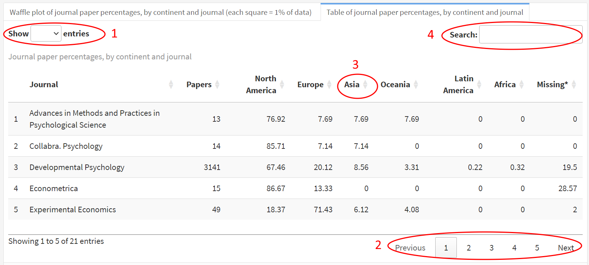

# Continent {data-navmenu="Economics"}

## Row 1 {data-width=2150} {.tabset .tabset-fade}

### Waffle plot of journal paper percentages, by continent (each square = 1% of data) {data-height=680}

```{r continent_waffle_overall_economics}
data_econ <- data %>% 
  filter(field == "economics")

waffle_continent(data_econ, citation, citation_size = 7)

```


### Table of journal paper percentages, by continent

```{r, continent_table_economics}
table_continent(data_econ)

```

> \* Percentages are calculated after excluding missing values. The *Missing* column shows the real percentage of missing values.

# Continent, by Year {data-navmenu="Economics"}

## Row 1 {data-height=680}

### Scatter plot of journal paper percentages, by continent and year {data-width=1460}

```{r, continent_scatter_overall_economics}
scatter_continent_year(data_econ, 
                       method = "loess",
                       ymin = 0,                     
                       ymax = 100,
                       yby = 20,
                       citation = citation2)

```

### Figure Instructions Reminder

Hovering over a plotly figure opens up a menu on the top-right of the figure with various features:

1. Download Plot as a PNG
2. Zoom and Pan Buttons
3. Zoom In/Out
4. Autoscale and Reset Axes
5. Hover Options

#### Interacting With Data Points

1. When hovering over individual data points, you can see the raw data (year and percentage of papers).
2. When hovering over the regression line, you can see the predicted data (also for year and percentage of papers)
3. Click, hold, and drag to zoom into a specific window of the chart. Double-click anywhere to come back to the original zoom level.
4. Double-clicking on one continent or country on the chart on the right will isolate that regression line (and corresponding observations) for that category (e.g., if you double-click on North America, only the green line will remain). Double-click any category (e.g,. North America) again to add back all the other categories.
5. Similarly, a single click on one continent or country on the chart on the right will remove only that category. Click it again to bring it back. You can also remove several specific categories one at a time this way. Double-click any category (e.g,. North America) again to add back all the other categories.
6. When the legend is too long, make sure to use the scroll bar to see the rest of the legend.

## Row 2 {data-height=680}

### Table of journal paper percentages, by continent {data-width=1460}

```{r, continent_table_journal_year_economics}
table_continent_year(data_econ)

```

> \* Percentages are calculated after excluding missing values. The *Missing* column shows the real percentage of missing values.

### Table Instructions Reminder

All tables use the [DT](https://rstudio.github.io/DT/) package, which converts regular dataframes into interactive datatable HTML table widgets via the open source JavaScript library DataTables.

In order to make the most out of DT tables, it is important to understand the various options they offer.

1. You can click on the top left to change the number of entries to show before needing to change page.
2. You can change page by clicking on the bottom right area.
3. You can sort by column by clicking on the column of your choice.
4. You can search for specific values (e.g,. journals or countries) by using the search bar at the top-right.

{width=100%}

# Continent, by Journal {data-navmenu="Economics"}

## Row 1 {.tabset .tabset-fade}

### Waffle plot of journal paper percentages, by continent and journal (each square = 1% of data) {data-height=680}

```{r continent_table_journal_figure_economics}
waffle_continent_journal(data_econ, citation)

```


### Table of journal paper percentages, by continent and journal

```{r continent_table_journal_economics}
table_continent_journal(data_econ)

```

> \* Percentages are calculated after excluding missing values. The *Missing* column shows the real percentage of missing values.

# Country {data-navmenu="Economics"}

## Row 1 {data-width=800} {.tabset .tabset-fade}

### Waffle plot of journal paper percentages, by country (each flag = 1% of data) {data-height=680}

```{r country_table_overall_economics, fig.width=4.5, fig.height=4.5}
waffle_country(data_econ, citation, citation_size = 7)

```


### Table of journal paper percentages, by country

```{r country_table_journal_economics}
table_country(data_econ)

```

> \* Percentages are calculated after excluding missing values. The *Missing* row shows the real percentage of missing values.

# Country, by Year {data-navmenu="Economics"}

## Row 1 {data-height=680}

### Scatter plot of journal paper percentages, by country and year {data-width=1460}

```{r, country_series_year_economics}
scatter_country_year(data_econ, 
                     method = "lm",
                     ymin = 0,
                     ymax = 100,
                     yby = 20,
                     citation = citation2)

# Include flags on scatter plot
# Note: doesn't work with ggplotly it seems
# library(ggflags)
# df.country.year %>%
#   mutate(year = as.numeric(year),
#          country = countrycode(country, "country.name", "genc2c"),
#          country = tolower(country),
#          country = as.factor(country)) %>%
#   nice_scatter(
#              predictor = "year",
#              response = "percentage",
#              group = "country",
#              colours = colors,
#              method = "lm",
#              groups.order = "decreasing",
#              ytitle = "% of All Papers") + 
#   geom_flag(aes(country = country)) +#%>%
#   scale_country(aes(country = country)) #%>%
  #ggplotly(tooltip = c("x", "y"))

# Time series dygraph 
# dygraph_year(data_econ)
# dygraph_year(data_econ, "country")

```

### Figure Instructions Reminder

Hovering over a plotly figure opens up a menu on the top-right of the figure with various features:

1. Download Plot as a PNG
2. Zoom and Pan Buttons
3. Zoom In/Out
4. Autoscale and Reset Axes
5. Hover Options

#### Interacting With Data Points

1. When hovering over individual data points, you can see the raw data (year and percentage of papers).
2. When hovering over the regression line, you can see the predicted data (also for year and percentage of papers)
3. Click, hold, and drag to zoom into a specific window of the chart. Double-click anywhere to come back to the original zoom level.
4. Double-clicking on one continent or country on the chart on the right will isolate that regression line (and corresponding observations) for that category (e.g., if you double-click on North America, only the green line will remain). Double-click any category (e.g,. North America) again to add back all the other categories.
5. Similarly, a single click on one continent or country on the chart on the right will remove only that category. Click it again to bring it back. You can also remove several specific categories one at a time this way. Double-click any category (e.g,. North America) again to add back all the other categories.
6. When the legend is too long, make sure to use the scroll bar to see the rest of the legend.

## Row 2 {data-height=680}

### Table of journal paper percentages, by country and year {data-width=1460}

```{r, country_table_year_economics}
table_country_year(data_econ)

```

> \* Percentages are calculated after excluding missing values. The *Missing* column shows the real percentage of missing values.

### Table Instructions Reminder

All tables use the [DT](https://rstudio.github.io/DT/) package, which converts regular dataframes into interactive datatable HTML table widgets via the open source JavaScript library DataTables.

In order to make the most out of DT tables, it is important to understand the various options they offer.

1. You can click on the top left to change the number of entries to show before needing to change page.
2. You can change page by clicking on the bottom right area.
3. You can sort by column by clicking on the column of your choice.
4. You can search for specific values (e.g,. journals or countries) by using the search bar at the top-right.

{width=100%}

# Country, by Journal {data-navmenu="Economics"}

## Row 1 {data-width=800} {.tabset .tabset-fade}

### Waffle plot of journal paper percentages, by continent and journal (each square = 1% of data) {data-height=680}

```{r country_table_journal_figure_economics}
waffle_country_journal(data_econ, citation)

```


### Table of journal paper percentages, by country and journal

```{r country_table_journal2_economics}
table_country_journal(data_econ)

```

> \* Percentages are calculated after excluding missing values. The *Missing* column shows the real percentage of missing values.
